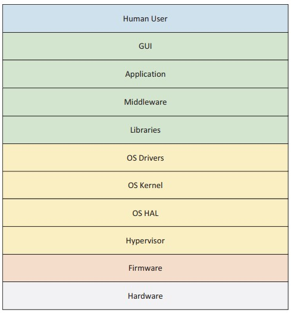

## 第一章

# 固件介绍

这一章将提供系统固件的概述。尽管系统固件的实现空间非常广泛，但我们讲论固件安全构造的相关细节。

## 固件与软件的相似之处

固件VS嵌入式系统VS操作系统内核VS操作系统应用

固件是平台软件中最底层的软件。现代固件，比如基于UEFI平台初始化的固件，还有EDK II、U-Boot、coreboot、Open Power的skiboot等等主要是C语言编写并带有小部分的汇编代码。这些代码经常存储在跟平台绑定的非易失性存储容器中。固件与平台软件栈剩余部分的关系如图1-1所示。

鉴于固件是基于C代码，因此也就更容易收到攻击而影响更上层的软件。这些攻击包括内存安全问题，涉及到多种缓存区溢出，例如栈溢出，堆溢出，和整型溢出。此外，针对应用或者操作系统空间的C代码的控制流攻击能对系统固件的做出改动。除了内存问题，针对固件的攻击也可在其他方面发生，包括机密性的问题，例如偷取机密。除此之外，固件常常参与系统的信任根的流程，由于平台的任何非认证的代码流程都能拒绝平台承诺的服务（特性），因此完整性考虑至关重要。平台启动可能包括访问网络，因此网络安全的考虑也能包含在平台固件中。而且，很少有平台（如果有的话）在片上系统（SOC）中只有一个中央处理器（CPU）核心，因此固件必须支持多进程处理（MP），并抵御该应用程序中存在的各种攻击，如竞争条件。最后，平台固件还必须防御其他类型的攻击，如侧通道、混淆代理和检查时间/计时（TOC/TOU）攻击。

鉴于列出的这些弱点，固件可能具有类似的平台强化策略，有针对这些弱点的定制实现。其中包括强化策略，如堆栈cookie检查、数据执行保护（DEP）、地址空间布局随机化（ASLR）、控制流保护/完整性（CFG/CFI）、代码签名强制检查、带解释器的沙箱、访问控制（用户认证和授权）、网络安全以及适用于固件执行环境的密码学。

除了这些防御策略，固件可能有类似软件的安全验证策略，但与上层的软件组织相比有不同的实现。这些验证方法包括静态代码分析、动态代码分析（地址错误检查Address Sanitizer，ASan）、模糊化、符号执行和可能的形式验证。