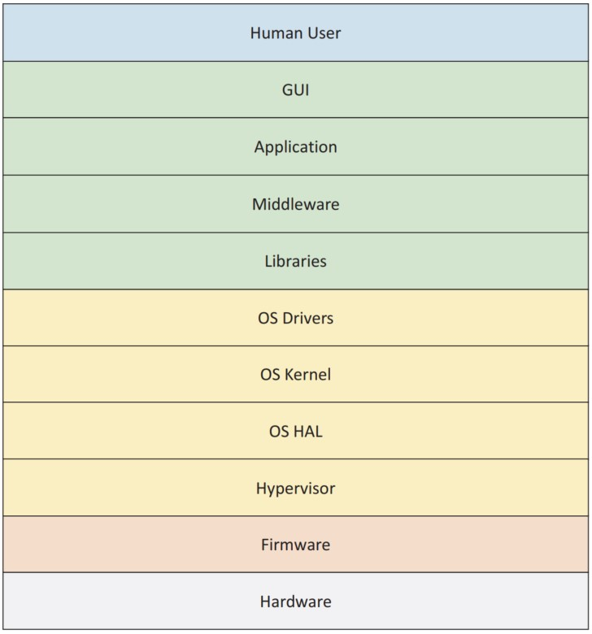

## 第一章

# 固件介绍

这一章将提供系统固件的概述。尽管系统固件的实现空间非常广泛，但我们讲论固件安全构造的相关细节。

## 固件与软件的相似之处

固件VS嵌入式系统VS操作系统内核VS操作系统应用

固件是平台软件中最底层的软件。现代固件，比如基于UEFI平台初始化的固件，还有EDK II、U-Boot、coreboot、Open Power的skiboot等等主要是C语言编写并带有小部分的汇编代码。这些代码经常存储在跟平台绑定的非易失性存储容器中。固件与平台软件栈剩余部分的关系如图1-1所示。

鉴于固件是基于C代码，因此也就更容易收到攻击而影响更上层的软件。这些攻击包括内存安全问题，涉及到多种缓存区溢出，例如栈溢出，堆溢出，和整型溢出。此外，针对应用或者操作系统空间的C代码的控制流攻击能对系统固件的做出改动。除了内存问题，针对固件的攻击也可在其他方面发生，包括机密性的问题，例如偷取机密。除此之外，固件常常参与系统的信任根的流程，由于平台的任何非认证的代码流程都能拒绝平台承诺的服务（特性），因此完整性考虑至关重要。平台启动可能包括访问网络，因此网络安全的考虑也能包含在平台固件中。而且，很少有平台（如果有的话）在片上系统（SOC）中只有一个中央处理器（CPU）核心，因此固件必须支持多进程处理（MP），并抵御该应用程序中存在的各种攻击，如竞争条件。最后，平台固件还必须防御其他类型的攻击，如侧通道、混淆代理和检查时间/计时（TOC/TOU）攻击。

鉴于列出的这些弱点，固件可能具有类似的平台强化策略，有针对这些弱点的定制实现。其中包括强化策略，如堆栈cookie检查、数据执行保护（DEP）、地址空间布局随机化（ASLR）、控制流保护/完整性（CFG/CFI）、代码签名强制检查、带解释器的沙箱、访问控制（用户认证和授权）、网络安全以及适用于固件执行环境的密码学。

除了这些防御策略，固件可能有类似软件的安全验证策略，但与上层的软件组织相比有不同的实现。这些验证方法包括静态代码分析、动态代码分析（地址错误检查Address Sanitizer，ASan）、模糊化、符号执行和可能的形式验证。

## 固件与软件的区别

尽管固件通常是用C这样的高级语言编写的，但它通常有特殊的需求。这些需求从环境开始。具体来说，固件的大小限制来源于微控制器中的较小的ROM和较小的RAM，在DRAM准备好之前只有SRAM或cache可用，管理模式(MM)的大小平衡于系统内存和有限的堆栈大小。

其他限制包括早期代码的就地执行（XIP）代码。也就是说，一些代码在ROM中执行。一方面这是些ROM代码，其中的一部分代码在数据段中没有可写的全局变量。并且对于这些早期的代码，例如UEFI平台初始化的PI阶段，Slim Boot的第一阶段，和coreboot的romstage, 尽管可以使用页表，但没有内存管理，包括虚拟内存。

除了内存管理，在早期代码流程中还有执行隔离的挑战。举个例子，Ring分隔（ring level in x86）可能可用也可能不可用。如此，一些固件的实现是仅仅让所有代码在特权模式下运行。尽管硬件可能包含多个CPU核心，但多进程处理（MP）可能启用，也可能不启用。事实上，主机固件的大多数实现是在单个处理器上执行服务。与多进程处理一样，其他常用的能力，如中断可能会被使能，但只能用于比那些操作系统简单得多的用途上。并且不像操作系统，固件通常与硬件直接交互。最后，固件拥有自己的执行基础， 例如内核和引导程序，与像Windows或Linux或管理程序（hypervisor）等高级操作系统（HLOSs）有所区别。

鉴于这些限制，固件可能有一类安全问题需要关注，但却不会出现在高级操作系统中。这些需要关注的安全包括来自硬件的攻击，例如寄存器、设备直接内存访问（DMAs）、缓存等。除了这些威胁，主机固件必须防范ROM中永久拒绝服务（PDoS）攻击，恢复服务通常需要复杂且特殊的恢复机制。并且如果对永久拒绝服务（PDoS）攻击的关注不够，固件可能会受到ROM中的永久根套件的影响，（有问题的套件）很难被病毒扫描工具发现。