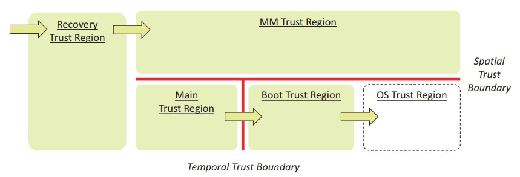
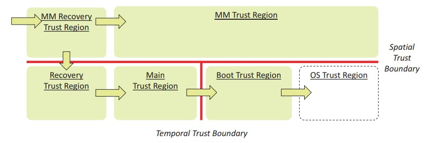
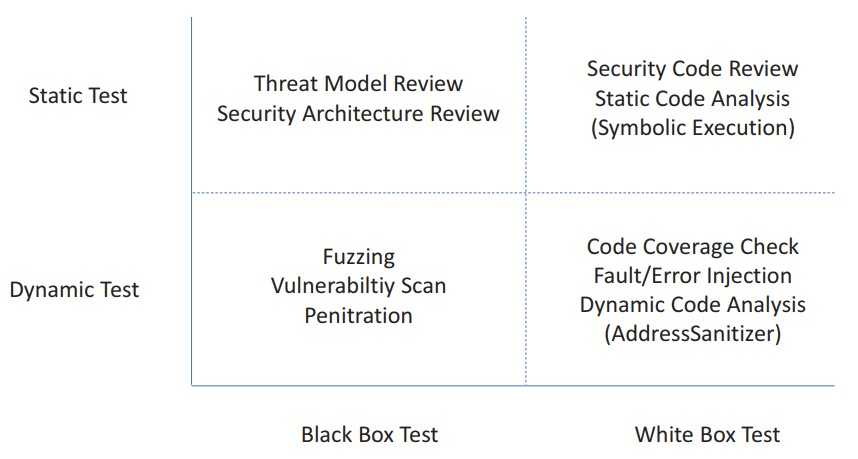
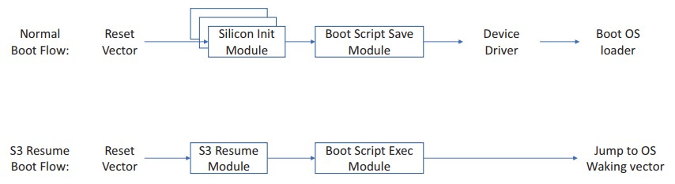
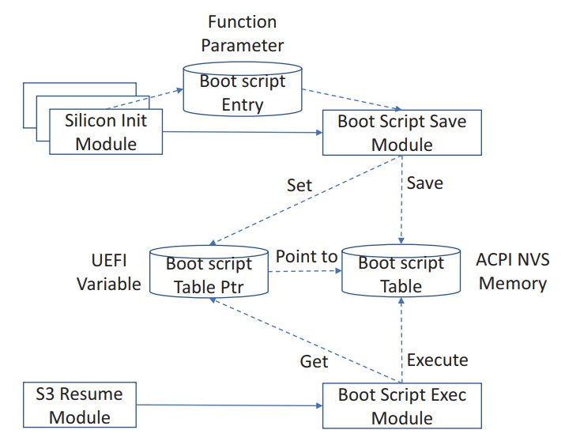
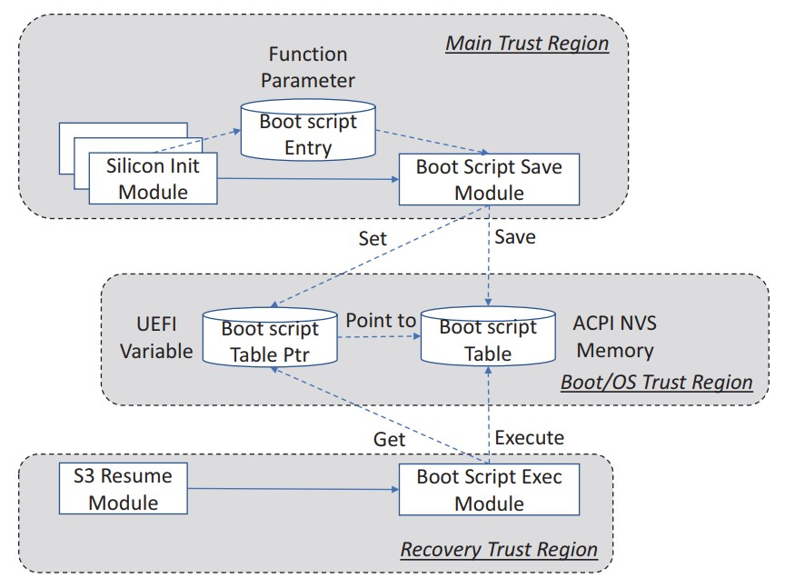
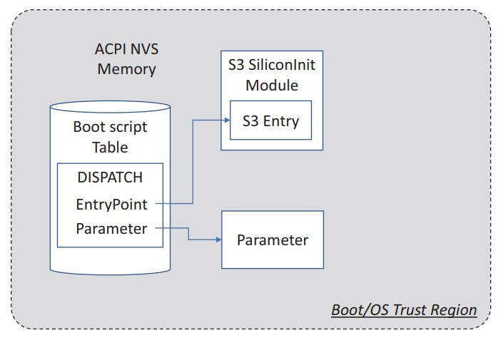
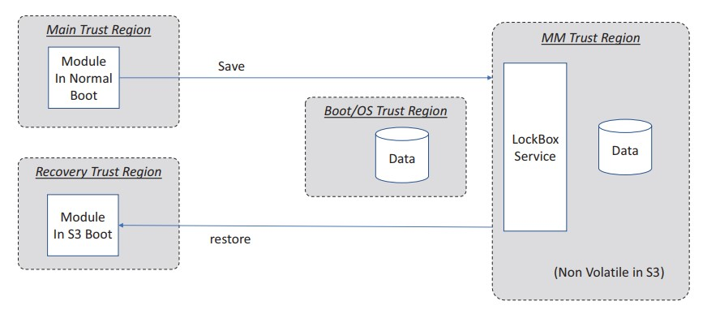

## 第二章

[TOC]

# 主动固件安全开发

固件开发与软件开发相似。几乎所有的软件安全开发生命周期（SDL）实践都可以应用于固件开发。图2-1显示了固件开发中可能涉及的主要活动。

## 需求阶段

第一步是收集安全需求。没有明确的要求，就不知道在什么情况下该保护什么。

### 安全需求

任何产品都有需求。可以将需求视作‘任何渴望或需要的声明’。这包括功能性需求，例如产品应该执行哪些行为。也存在市场需求，例如产品应该何时上市以及花费多少成本。最后，存在安全需求，包括产品必须遵守的安全属性，包括各种威胁的缓解措施。

安全需求也应该包括行业标准要求。如果在美国生产，则需要遵循NIST指南，如NIST SP800-193《平台固件弹性指南》。如果在中国生产，则需要遵循GB(强制)或GB/T（推荐）规范，例如GB/T 36639-可信计算规范：针对服务器的可信的支持平台。如果是X86个人计算机或服务器平台，则可能需要遵循通用可扩展固件接口（UEFI）规范和TCG标准，如PC客户端平台固件概述（PFP）规范或设备标识组合引擎（DICE）架构。如果是ARM产品，则可能需要遵循ARM平台安全架构（PSA）规范或ARMv8M的可信基础系统架构（TBSA）。对于车辆产品，可能需要遵守ISO 26262功能安全要求。

## 威胁模型与架构阶段

威胁模型和安全体系结构来源于安全需求。他们将客户的语言映射为开发人员的语言。

### 威胁模型分析

就威胁而言，威胁模型分析是从假设攻击者的角度识别潜在威胁并对其进行优先处理的过程。威胁模型分析应该在功能架构阶段进行。功能架构师应与安全架构师合作，识别资产、对手和威胁（攻击面），然后确定威胁的优先级，并选择缓解措施。在（进行）这些步骤之前，架构师需要清楚地了解系统是怎么工作的。

现有的书籍和工具可以教授如何执行威胁模型分析。这些现有材料大多从控制流分析（CFA）和数据流分析（DFA）开始。控制流分析（CFA）关注代码如何从一个地方运行到另一个地方。另一方面，数据流分析（DFA）侧重于如何将数据从一个地方移动到另一个地方。

最后，我们需要优先处理这些威胁。应该同时考虑威胁被利用的可能性和对系统的影响。可以选择处理严重的、高优先级的威胁并定义缓解措施。可以选择不处理中等或低优先级的威胁，并留到下一代产品。例如，来自恶意硬件的的威胁之前没有考虑过，现在则需要考虑它，因为硬件攻击越来越频繁。一些新的攻击，例如故障攻击，对于低成本的商业平台被认为是中等优先级，但是对于高品质的平台而言就是高优先级。

为了了解更多细节，以STRIDE威胁模型作为例子。这里讨论的威胁模型是一个通用的指南，是系统固件的基线。对于每个特定的功能，除了通用的威胁模型，还会有额外的基于功能的威胁模型（见表 2-1）。

表 2-1 威胁与所需属性
| **威胁** | **所需属性** |
| :--- | :--- |
| 欺骗 | 身份验证 |
| 篡改 | 完整性 |
| 否认 | 不可否认 |
| 信息暴露 | 机密性 |
| 拒绝服务 | 可适用 |
| 权限提升 | 鉴权 |

在系统固件中，拒绝服务在当前的启动过程中可能是暂时的，也有可能是永久的，在这种情况下，系统不能再次正常启动。后者更为严重，被命名为永久性拒绝服务（PDoS）。

针对固件STRIDE模型，将考虑如表 2-2中所示的对手。

表 2-2 对手与示例
| **对手** | **示例** |
| :--- | :--- |
| 网络攻击者 | 攻击者可能通过网络连接系统以进行窃听，拦截、伪装或修改网络数据包。|
| 无特权软件攻击者 | 攻击者可能在操作系统的应用层中运行ring 3级别的软件。攻击者可能执行基于软件的侧信道攻击（例如使用高速缓存计时）。|
| 系统软件攻击者 | 攻击者可能在操作系统的内核或管理程序中运行ring 0级别的软件。或攻击者可能在固件启动阶段运行第三方固件代码。攻击者可能执行基于软件的侧信道攻击（例如使用高速缓存计时，性能计数，分支信息或电源状态）。|
| 普通的硬件攻击者 | 攻击者可能接触平台硬件（如电源按钮或跳线），并连接/移除普通的恶意设备（例如硬件调试器，PCI桥接外部接口，PCIe[外围组件互联接口]卡接入PCIe卡槽，内存DIMM，NIC电缆，硬驱，键盘，USB设备，蓝牙设备）。攻击者可能劫持普通的设备总线（例如串行外围接口[SPI]总线或I2C总线）。|
| 有技巧的硬件攻击 | 攻击者可能劫持复杂的系统总线，例如内存总线和PCIe总线。攻击者可能执行基于硬件的侧信道攻击，例如功率分析，热分析和电磁分析。攻击者可能执行故障攻击。|

根据美国国家标准与技术研究所（NIST）SP800-193的规定，系统固件设计需要考虑保护、检测和恢复。

为了与BIOS的要求相匹配，BIOS的主要安全目标包括以下内容：
1. 阻止对BIOS代码和关键数据进行任何未经授权的修改（保护）。
2. 使固件组件成为信任链（CoT）的一部分，并提供平台认证（检测）。
3. 在损坏或非法修改后将BIOS恢复到真实状态
修改（恢复）。

三大支柱——保护、检测和恢复——也被认为是主要的缓解措施。对BIOS而言需要考虑的资产是闪存内容、启动流程、S3恢复、管理模式和构建工具。需要对每项资产进行分析。

### 闪存内容
NIST SP800-147和SP800-147B提供了系统固件保护指南，包括系统固件保护和更新的详细信息。NIST SP800-193提供了平台固件弹性指南。它将保护扩展到三个原则：保护、检测和恢复。它还将范围从系统固件（BIOS）扩大到平台上的所有固件。

此处的闪存内容包括固件代码（例如，预先可扩展固件接口初始化（PEI）、驱动程序执行环境（DXE）和引导设备选择（BDS）等）和固件数据（例如，UEFI变量、微代码等）。有关闪存内容的威胁、对手和缓解，请参阅表2-3、2-4和2-5。

表 2-3 针对资产的威胁 —— 闪存内容
| **威胁** | **示例** |
| :--- | :--- |
| 欺骗 | 无 |
| 篡改 | 如果固件没有受到保护或锁定，攻击者可能会直接修改固件。如果固件更新过程未通过验证，则攻击者可能会发送恶意的固件更新映像进行更新。|
| 否认 | 如果固件没有正确实现事件日志记录，恶意程序可能会擦除或截断日志。|
| 信息泄露 | 如果系统软件将机密存储在固件中，则攻击者可能读取固件内容并获取机密。|
| 拒绝服务 | 如果攻击者可能修改固件内容（代码或数据）并导致固件崩溃，则系统可能不再启动。这变成了永久性的拒绝服务。|
| 权限提升 | 如果攻击者可能修改固件内容（代码或数据）并将木马程序存储在固件中，则木马程序可能会隐藏自己并获得更高的权限。|

表 2-4 针对资产的对手 —— 闪存内容
| **对手** | **示例** |
| :--- | :--- |
| 网络攻击者 | 如果网络在X86系统管理模式（SMM）锁定和闪存锁定之前启用，则攻击者可能会发送不正常的网络数据包。|
| 无特权软件攻击者 | 攻击者可能会触发固件更新或写入UEFI变量。|
| 系统软件攻击者 | 攻击者可能访问硅片寄存器来解锁闪存访问寄存器。攻击者可能会创建一个竞争条件来破坏闪存写保护或闪存更新验证。|
| 普通的硬件攻击者 | 攻击者可能在闪存更新或恢复期间按下电源按钮，或者攻击者可能设置跳线将系统启动模式从正常启动修改为恢复甚至制造模式。攻击者可能会在闪存更新或恢复期间附加PCI桥接接口以执行DMA攻击。攻击者可能会劫持SPI总线来读取或写入芯片数据。|
| 有技巧的硬件攻击 | 无 |

表 2-5 针对资产的缓解措施 —— 闪存内容
| **缓解措施** | **示例** |
| :--- | :--- |
| 保护 | 对于代码区域，闪存写保护必须始终应用。在闪存更新过程中，必须对新固件映像进行验证，并检查版本以防止回滚攻击。为了缓解检查时间/使用时间（TOC/TOU）攻击，必须在检查之前将新固件镜像复制到安全环境中。在闪存更新期间必须启用DMA保护。对于数据区域，UEF有效的变量写入必须在隔离的执行环境中进行。有效的变量数据必须经过验证，并且回滚保护必须启用。正如在代码区域保护中一样，为了缓解TOC/TOU攻击，必须在检查之前将新的可变内容复制到安全的环境中，并且DMA保护必须应用于此环境。此外，机密不得保存到固件代码或数据区域。|
| 检测 | 检测发生在下一次启动时。对于代码区域，行业可能有不同的解决方案来确保初始化启动代码未经修改，如Project Cerberus、Intel Boot Guard等。对于数据区域，UEFI变量驱动程序需要检测出在不使用UEFI变量服务的情况下变量区域发生了修改。|
| 恢复 | 如果检测到错误，则检测到故障的实体需要启动恢复过程，并且恢复数据必须处于已知的良好和安全的配置中，并且必须由可信且始终可用的来源交付。|

### 启动流程
系统固件的主要工作是初始化芯片，然后将控制权转移到操作系统。由于固件几乎是运行在系统上的第一个组件，系统固件的另一项职责是维护在统一可扩展固件接口（UEFI）规范中定义的安全启动链和由可信计算组（TCG）定义的可信启动链。

这里的安全启动链意味着第一个实体需要在运行第二个实体前验证其是否良好，如果验证失败则不运行第二个实体。可信启动链意味着第一个实体需要在运行第二个实体前测量它，然后直接运行第二个实体。认证发生在后续。系统固件需要维护两种启动流程。验证和测量不允许绕过。

此外，系统固件可能需要验证最终用户来确定用户是否被授权执行某些动作。例如，用户可能被要求输入硬盘驱动器密码以继续启动。或者用户被要求输入管理员密码以进入设置页面。这些动作也不能被绕过。

表 2-6 针对资产的威胁 —— 启动流程
| **威胁** | **示例** |
| :--- | :--- |
| 欺骗 | 如果固件需要对用户进行验证，攻击者可能伪造身份或绕过身份验证检查。|
| 篡改 | 攻击者可能想要修改安全启动逻辑或可信启动逻辑（代码或配置数据）来绕过验证或测量。|
| 否认 | 无 |
| 信息泄露 | 用户身份和设备密码是秘密信息。攻击者可能想偷走它们。|
| 拒绝服务 | 如果攻击者可能在验证期间修改安全启动的配置数据而导致系统奔溃。|
| 权限提升 | 如果攻击者绕过用户身份验证，他们可能会进入固件设置页面来修改配置。如果攻击者绕过安全启动验证，他们可能会在ring 0级别环境中运行未经授权的第三方代码。|

表 2-7 针对资产的对手 —— 启动流程
| **对手** | **示例** |
| :--- | :--- |
| 网络攻击者 | 攻击者可能会发送不正常的网络数据包来注入代码到系统中。攻击者可能恶意的UEFI镜像来绕过或破坏安全启动逻辑。|
| 无特权软件攻击者 | 攻击者可能写入不正常的UEFI有效变量来破坏安全启动配置。|
| 系统软件攻击者 | 攻击者可能发送命令给隔离的执行环境来修改安全启动配置。攻击者可能使能侧信道来获取内存中的机密。|
| 普通的硬件攻击者 | 攻击者可能附加PCI桥接接口以执行DMA攻击来读取内存中的机密或写入代码区域来绕过验证。|
| 有技巧的硬件攻击 | 攻击者可能劫持内存总线来读取内存中的机密或写入代码区域来绕过验证。|

表 2-8 针对资产的缓解措施 —— 启动流程
| **缓解措施** | **示例** |
| :--- | :--- |
| 保护 | 使用前请检查不受信任的外部输入（如网络数据包、选项ROM、操作系统加载程序和UEFI有效变量）。在验证前不要运行任何不受信任的第三方代码。如果机密生成，在使用后（例如来自HII的临时输入）必须清除。如果机密需要存储，选择包括直接保存机密到硬件（例如TCG OPAL密码），保存散列值加盐值到UEFI有效变量（例如用户密码），或保存机密到隔离环境（例如TCG TPM MOR2）。这种情况下必须启用侧信道预防。DMA保护必须启用。内存总线攻击在范围内，则内存加密必须使用。|
| 检测 | 无 |
| 恢复 | 无 |

启动流程的威胁、对手和缓解措施见表 2-6、2-7和2-8。

### S3恢复
S3恢复是一个特殊的启动流程。它由高级配置和电源接口（ACPI）规范定义。在S3恢复期间，系统从正常启动恢复配置，并跳转到操作系统唤醒向量。

所有应用于正常启动的保护措施也必须应用于S3恢复启动流程。S3恢复的威胁、对手和缓解措施见表2-9、2-10和2-11。

表 2-9 针对资产的威胁 —— S3恢复
| **威胁** | **示例** |
| :--- | :--- |
| 欺骗 | 无 |
| 篡改 | 攻击者可能试图修改S3配置。也作为S3启动脚本被熟知。|
| 否认 | 无 |
| 信息泄露 | 如果S3配置包括机密（例如高级技术附件[ATA] HDD 密码），攻击者可能想要偷走机密。|
| 拒绝服务 | 攻击者可能摧毁S3配置来阻止系统启动。 |
| 权限提升 | 攻击者可能关闭储存在S3配置中的保护措施，例如寄存器锁止。|

表 2-10 针对资产的对手 —— S3恢复
| **对手** | **示例** |
| :--- | :--- |
| 网络攻击者 | 无 |
| 无特权软件攻击者 | 攻击者可能写入不正常的UEFI有效变量来破坏S3配置。|
| 系统软件攻击者 | 攻击者可能发送命令给隔离的执行环境来修改S3配置。如果机密保存在隔离环境，攻击者可能发送命令来获取机密或使用侧信道偷走机密。|
| 普通的硬件攻击者 | 无 |
| 有技巧的硬件攻击 | 无 |

表 2- 11 针对资产的缓解措施 —— S3恢复
| **缓解措施** | **示例** |
| :--- | :--- |
| 保护 | S3配置数据必须保存在安全的地方。存储的安全位置实例包括嵌入式的只读代码区域、只读变量、隔离的执行环境或锁箱（LockBox）。如果S3配置数据是机密，则必须保存在隔离的执行环境或锁箱来防止未授权的读取。|
| 检测 | 无 |
| 恢复 | 无 |

### 管理模式
管理模式是一种特殊的系统执行环境。X86系统拥有系统管理模式（SMM），而ARM有ARM TrustZone。固件代码在管理模式被认为是安全世界，并且拥有很高的权限。管理模式的威胁、对手和缓解措施见表2-12、2-13和2-14。

表 2-12 针对资产的威胁 —— 管理模式
| **威胁** | **示例** |
| :--- | :--- |
| 欺骗 | 无 |
| 篡改 | 攻击者可能更新管理模式内存来注入代码或数据。|
| 否认 | 无 |
| 信息泄露 | 管理模式可能包含机密（例如密码， TPM MOR2熵）或它自身信息（代码和数据结构位置）。这些信息可能暴露在正常世界中。|
| 拒绝服务 | 管理模式只有有限的资源（例如内存）。攻击者可能发送命令给管理模式代码来耗尽资源。 |
| 权限提升 | 攻击者可能在管理模式下获得未经授权的执行权限。例如，如果管理代码调用正常世界代码，攻击者可能用恶意代码替换原来的代码来获得特权执行。攻击者可能针对管理模式构建混淆的代理攻击。例如，操作系统可能发送命令给管理模式代码使之修改管理程序的内存或管理模式内存。|

表 2-13 针对资产的对手 —— 管理模式
| **对手** | **示例** |
| :--- | :--- |
| 网络攻击者 | 无 |
| 无特权软件攻击者 | 无 |
| 系统软件攻击者 | 攻击者可能充分利用管理模式代码中的实现流程读取或修改管理模式内容或更高权限环境的内容，例如管理程序。攻击者可能使用侧信道偷取管理模式内存中的机密。|
| 普通的硬件攻击者 | 无 |
| 有技巧的硬件攻击 | 无 |

表 2-14 针对资产的缓解措施 —— 管理模式
| **缓解措施** | **示例** |
| :--- | :--- |
| 保护 | 管理模式代码在构建后，不晚于第三方代码运行前锁定管理模式。管理模式代码不得调用正常世界的代码。系统必须移除不必要的管理模式的句柄。需要的管理模式的句柄必须在使用前验证不受信任的外部输入，包括通信缓冲通信缓冲内部的指针，用作通信缓冲指针的通用寄存器，硬件基址寄存器。检查后的内容必须拷贝到管理模式内存来预防TOC/TOU。管理模式句柄必须预防未授权访问其自身和更高权限的内容，例如管理程序和操作系统内核内存。管理模式句柄必须预防侧信道攻击弄清任何机密。管理模式句柄不得分配更多的资源来服务请求。如果资源被额外分配，在句柄返回正常世界前就必须被释放。 |
| 检测 | 无 |
| 恢复 | 无 |

### 构建工具
1983年，Ken Thompson和Dennis Ritchie一起获得了图灵将。Ken Thompson发表了题为“关于信任的信任的反思”，并展示了如何注入特洛伊木马到编译器中。之后，编译器产生了有缺陷的二进制。攻击工具并非不可能。这不是传统的针对最终系统的攻击，但是代表了针对构建环境中的工具链的攻击。

缓解措施只有信任来自可信来源的工具链和源代码，之后保护构建环境中的工具链。

| **注释** | 并不是所有的固件共享上文展示的相同的威胁模型。有些主机固件可能不支持S3恢复。像这样的，S3恢复资产不存在。有些设备固件可能不支持管理模式。像这样的，管理模式资产不存在。对那些非主机固件而言，运行时服务可能成为另一种资产。|
| :--- | :--- |

### 非主机运行时服务
运行时服务是非主机固件提供的服务。它与正常的主机操作系统环境共存，例如基板管理控制器（BMC）用于服务器平台，嵌入式控制器（EC）用于客户端平台。运行时服务能提供向主机操作系统提供本地服务或向远程系统提供带外（OOB）服务。

BMC作为实例，其威胁、对手和缓解措施见表 2-15、2-16和2-17。

表 2-15 针对资产的威胁 —— 非主机运行时服务
| **威胁** | **示例** |
| :--- | :--- |
| 欺骗 | 攻击者可能破坏用户身份认证流程来访问BMC内部数据。 |
| 篡改 | 攻击者可能更新BMC内存存储来注入代码或数据。|
| 否认 | 攻击者可能截断保存在BMC中事件日志。 |
| 信息泄露 | BMC可能包括敏感信息（例如用户管理数据）。这些信息可能暴露给正常世界。|
| 拒绝服务 | BMC带外网络服务可能有网络拒绝服务（DOS）风险。|
| 权限提升 | 攻击者可能获取内存中或SPI闪存上的BMC内部权限数据。|

表 2-16 针对资产的对手 —— 非主机运行时服务
| **对手** | **示例** |
| :--- | :--- |
| 网络攻击者 | 攻击者可能通过RedFish和/或智能平台管理接口（IPMI）发送不正常的包给BMC运行时带外（OOB）服务。 |
| 无特权软件攻击者 | 无 |
| 系统软件攻击者 | 攻击者可能通过RedFish和/或智能平台管理接口（IPMI）或通过处于主机和BMC之间专用的本地总线发送不正常的包给BMC运行时带外（OOB）服务。|
| 普通的硬件攻击者 | 无 |
| 有技巧的硬件攻击 | 无 |

表 2-17 针对资产的缓解措施 —— 非主机运行时服务
| **缓解措施** | **示例** |
| :--- | :--- |
| 保护 |所有来自带外或带内的网络包在使用前应该被验证。BMC中的网络栈应该抵御网络拒绝服务（DOS）。用户身份验证应该在访问BMC资源前完成。用户身份验证不得以任何方式绕过。管理员和普通用户的权限应该分开。管理工作只能使用管理员账户完成。敏感信息不得以明文形式保存在BMC闪存中。来自主机本地总线的命令也应该被验证。 |
| 检测 | 无 |
| 恢复 | 无 |

## 安全架构与设计

一旦确定了威胁和缓解措施，就需要设计固件。“计算机系统中的信息保护”提供了通用的安全设计准则，例如经济适用原则、失败——默认安全、完全仲裁、开放设计、权限分离、最小权限、最小公共化原则和心理可承受，这些准则至今仍能使用。

从信任区域开始。不同的信任区域被信任边界隔离。信任边界可以是时间的或空间的。以图2-2展示的系统固件启动流程作为例子。垂直线显示了时间的信任边界，水平线显示了空间的信任边界。

    1. 恢复信任区域: 平台重置后，进入恢复信任区域。这被当作恢复的信任根（RTRec）。恢复信任区域执行基本的初始化并加载下一个组件 ———— 主信任区域。根据启动模式，主信任区域来自主要的闪存区域或可恢复闪存区域。
    2. 主信任区域：这是最大的信任区域。所有的系统初始化应该在此信任区域内完成。此区域仅执行原始设备制造商（OEM）的代码。没有第三方的代码可以在此区域内执行。通常，这个区域被当作更新的信任根。此区域推出之后，闪存应该被锁住。闪存更新应该在此区域内完成。此区域加载启动信任区域作为下一个阶段。这里有条红线，因为这是在任何第三方代码开始执行前最后一个锁定所需接口的机会。
    3. 启动信任区域：系统初始化结束之后，它开始启动操作系统。第三方代码可能运行在此，例如操作系统加载程序或PCI选项ROM。作为最后一步，操作系统的加载程序把控制转交给操作系统，然后进入操作系统信任区域。
    4. 管理模式（MM）信任区域：前面三个信任区域都是短暂的。管理模式信任区域在运行时可用。它可能由主信任区域加载。只有管理模式的代码才能运行在管理模式信任区域，例如X86系统管理模式或ARM TrustZone。管理模式信任区域中的数据可能被恢复信任区域或主信任区域所信任，因为管理模式信任区域被当作安全世界。安全世界能被非安全世界所信任。

为了将信任区域与UEFI/PI BIOS匹配，可以见图2-3显示的流程。安全（SEC）和预先可扩展固件接口（Pre-EFI）初始化(PEI)能被当作恢复信任区域。它能检测启动模式并决定哪里启动。驱动程序执行环境（DXE）是主信任区域。它加载驱动程序并初始化被当作管理模式信任区域的系统管理模式（SMM）。之后系统启动到启动设备选择（BDS）阶段。启动设备选择（BDS）可以选择是启动到UEFI操作系统或传统的操作系统。由于UEFI安全启动在启动信任区域启用，我们将启动信任区域与传统的信任区域分开。因此，信任链在操作系统启动期间得以维护。在传统信任区域中，不执行任何验证，并且信任链已被破坏。在图2-3中，我们在主信任区域之后画了一条红色的垂直线。这这是一个体系结构点，表示平台退出制造商的授权状态并且开始运行第三方代码。在UEFI平台初始化（PI）规范中，此事件命名为驱动程序执行环境结束(EndofDxe)。管理模式信任区域和引导信任区域之间的水平线显示了高权限管理模式执行环境与正常执行环境之间的隔离。

图2-3是典型的系统固件启动流程，尽管不同的系统会选择对应的变体。例如，管理模式信任区域可能在S3恢复阶段或X86的独立的管理模式直接被恢复信任区域加载。

另一个例子是系统有一个专用的管理模式恢复信任区域加载管理模式信任区域和正常的恢复信任区域。有可信固件的ARM系统可能使用这种模型。见图2-4和图2-5。

每一个信任区域需要考虑CIA的属性，机密性、完整性和可用性。

对于机密性而言，信任区域不得暴露任何机密到此区域外。例如密码或机密不应该以明文形式保存在非易失性存储中。

对于完整性而言，每一个信任区域只能信任前一个信任区域和当前信任区域的输入，但是它不能信任其他信任区域的输入。例如，管理模式的信任区域不能信任来自启动信任区域或传统信任区域的任何输入，例如管理模式通信缓冲区。恢复信任区域不能信任来自操作系统信任区域的任何输入。例如操作系统中的UEFI变量集。验证始终是需要的。不受信任的输入包括但不限于新的固件镜像、来自外部存储的恢复镜像、管理模式通信缓冲、网络包、第三方镜像，例如操作系统加载程序和PCI选项ROM、文件系统与磁盘分区，最后还有硬件输入，例如USB描述符或蓝牙广告消息。

每个信任区域也应该在当前的信任区域内锁定系统配置并且不得暴露不安全的配置到下一个信任区域。以管理模式信任区域为例，如果主信任区域加载管理模式信任区域，主信任区域需要锁定管理模式配置。如果恢复信任区域加载管理模式，那么恢复信任区域需要锁定管理模式配置。另一个例子是闪存内容锁，恢复模式做启动模式检测的地方，并且在正常启动模式下应该锁定闪存内容。如果系统处于更新模式，那么恢复信任区域保持闪存区域开放。如果主信任区域是更新的信任根，则转移控制给主信任区域。主信任区域执行新的闪存镜像验证并且更新闪存内容。最后，主信任区域锁定闪存内容。

对于可用性而言，每个瞬态信任区域应该确保系统能继续启动到下一个可信区域，即使收到意外的输入。运行时信任区域因该确保提供服务句柄是始终可用的。例如，X86系统中的系统管理模式（SMM）句柄，ARM系统中的TrustZone服务，或在服务器基板管理控制器（BMC）中的管理服务。这些服务句柄在实现中需要确保没有资源泄露。

除了拥有威胁模型和安全架构之外，还有确保威胁模型和安全架构是充分的社会方面。为此，威胁模型和安全架构审查是安全开发周期（SDL）的一部分，安全开发周期（SDL）涉及审查威胁的具体缓解措施。这一过程涵盖了正式到半正式，再到非正式的审查范围。这些审查通常由新安全功能的发起人领导，发起人向一些主题领域的专家展示设计的细节。

### 安全测试策略规划

一旦完成威胁模型与安全架构，过程中的下一步包括定义一种方法来评估特定安全的组件是否满足设计意图。这包括系统级的测试到各个组件的所以方法。安全测试应该基于威胁模型分析，并且聚焦于资产和攻击点。例如，图2-6展示的测试方法可以被考虑。

## 真实的例子

看下真实的例子。在EDK II UEFI固件里，需要支持S3恢复特性。从最终用户的视角看，他们可以点击操作系统开始菜单->睡眠。然后机器进入睡眠状态。当他们再次按下电源键，系统迅速唤醒并返回它原来的状态。我们如何进行威胁模型分析？

### 步骤0：进行控制流分析和功能的数据流分析

在正常的启动流程中，当芯片模块进行初始化时，它们也会调用启动脚本保存（BootScriptSave）模块来保存芯片寄存器信息。在S3恢复启动流程，没有芯片初始化模块被需要，因为S3恢复模块调用启动脚本执行者（BootScriptExecutor）模块并且后者回放芯片寄存器配置。然后固件跳转到操作系统唤醒向量来唤醒系统。这样设计的目的是确保S3恢复能比正常启动更快。图2-7显示了控制流分析。

图2-8显示了S3恢复实现第一个版本中的数据流分析。在正常启动期间，芯片初始化模块把启动脚本记录作为函数调用的参数传递给启动脚本保存模块。每个启动脚本记录包括寄存器类型，寄存器地址和寄存器值。然后启动脚本保存模块收集所有的启动脚本记录并且把它们保存到一个大的启动脚本表中。启动脚本表是一个ACPI非易失存储器（NVS）内存，因此它不会被操作系统覆盖。同时，启动脚本保存模块把启动脚本表（BootScriptTable）的指针保存到了UEFI变量中。在S3恢复启动中，S3恢复模块能获取BootScriptPtr这个UEFI变量，以启动脚本表的地址被熟知，并且从ACPI非易失存储器（NVS）内存中执行启动脚本。

然后我们将它们划分成不同的信任区域。见图2-9。图中芯片初始化模块和启动脚本保存模块是主信任区域。S3恢复模块和启动脚本执行者模块是恢复信任区域。UEFI变量启动脚本表指针和在ACPI内存中的启动脚本表处于启动信任区域或操作系统信任区域，因为操作系统加载程序或操作系统中的代码可能修改UEFI变量或ACPI非易失存储器（NVS）内存。

### 步骤1：识别功能特定的资产

从数据流分析中，我们认为在ACPI非易失存储器内存中的BootScriptTablePtr UEFI变量和启动脚本表是首要资产，因为它们保存着芯片寄存器设置信息。

代码。例如芯片初始化模块、启动脚本保存模块、S3恢复模块和启动脚本执行者模块是固件代码的一部分。从整个UEFI固件视角，他们也是资产。但是对这个特定功能而言，他们不是资产。因此在这个S3恢复威胁模型分析中我们不需要考虑它们。代码模块在整个UEFI固件闪存保护的威胁模型中应该被考虑。

### 步骤2：识别对手

资产在ACPI非易失存储器内存和UEFI变量中。因此，我们需要考虑系统软件对手，对手具有修改ACPI非易失存储器内存的能力并且可以调用UEFI服务来更新变量。

在这个例子中，我们不用考虑普通的硬件对手。应该在整个UEFI变量保护的威胁模型中考虑一个具有变量修改能力的普通的硬件对手。

应该在整个内存保护的威胁模型中考虑一个具有内存内容修改能力的普通的硬件对手，内存保护使用设备I/O内存管理单元（IOMMU）和所有内存加密（TME）。

### 步骤3：识别威胁

从之前的讨论，我们意识到ACPI非易失存储器中的BootScriptPtr变量和在启动脚本表属于启动信任区域或操作系统信任区域。因此，它们可能被修改。恢复信任区域中S3恢复模块和启动脚本执行者模块不应该信任那些数据。

现在我们使用STRIDE模型来执行分析（见表2-18）。

表 2-18 S3恢复实现威胁
| **威胁** | **是/否** | **注释** |
| :--- | :--- | :--- |
| 欺骗身份 | 否 | 假设没有用户身份涉及到S3。在BIOS中唯一涉及到用户身份是用户身份验证，但在S3恢复不会发生。 |
| 篡改数据 | 是 | 攻击者可能直接修改ACPI非易失存储器内存中的启动脚本表或使用UEFI变量服务去修改BootScriptTablePtr UEFI变量。|
| 否认 | 否 | 无 |
| 信息泄露 | 否 | 假设没有机密/密码保存在启动脚本中。在S3中需要硬件驱动器密码解锁，但是密码不得保存在S3脚本中。它应该包含在硬件启动器密码方案的威胁模型中。|
| 拒绝服务 | 是 | 拒绝服务可能是数据篡改的结果。由于修改的启动脚本数据，系统不能成功恢复。由于在启动脚本中执行闪存区块锁定的错误实现，它可能导致永久的拒绝服务（PDoS）。攻击者可能跳过锁定设置并且在闪存中编程错误的镜像。|
| 权限提升 | 是 | 由于在启动脚本中系统管理模式（SMM）的错误实现，它可能是篡改数据的结果。攻击者可能跳过系统管理模式并且更新系统管理模式的内容来获得系统管理模式中的执行特权。|

通用漏洞评分系统（CVSS）是决定漏洞优先级的好方法。基本分数包括以下方面：
    攻击向量（AV）：网络（N），相邻的（A），本地的（L），物质的（P）
    攻击复杂度（AC）：低（L），高（L）
    所需权限（PR）：无（N）、低（L）、高（H）
    用户交互（UI）：无（N），必需（R）
    范围（S）：未更改（U），已更改（C）
    机密性（C）：无（N）、低（L）、高（H）
    完整性（I）：无（N）、低（L）、高（H）
    可用性（A）：无（N）、低（L）、高（H）

如果我们在没有任何保护的情况下将S3启动脚本保存在ACPI非易失存储器中，并且闪存锁和系统管理模式锁依赖于启动脚本，那么CVSS得分可能是CVSS:3.0/AV:L/AC:L/PR:H/UI:N/S:C/C:N/I:H/A:H:7.9（高）。

我们需要缓解规划。

### 步骤4：创建缓解措施

创建缓解措施是威胁模型分析的最后一步。我们需要提出如何减轻威胁的基本想法，然后制定解决方案的详细设计。表2-19显示了基本思想。

表 2-19 S3恢复实现的安全对象

表 2-18 S3恢复实现威胁
| **威胁** | **是/否** | **安全对象** |
| :--- | :--- | :--- |
| 欺骗身份 | 否 | 无 |
| 篡改数据 | 是 | 1. 在ACPI非易失存储器内存中保护启动脚本表内容。2. 保护BootScriptPtr UEFI变量。 |
| 否认 | 否 | 无 |
| 信息泄露 | 否 | 无 |
| 拒绝服务 | 是 | 3. 即使启动脚本被篡改，也要锁定闪存区块。|
| 权限提升 | 是 | 4. 即使启动脚本被篡改，也要锁定系统管理模式。|

    1. 保护启动脚本表内容

ACPI非易失存储器是操作系统可访问的内存，并且它不能在BIOS标记为只读。为了保护启动脚本表，我们能将启动脚本表移动到操作系统信任区域不能访问的管理模式信任区域。在X86系统中，可以由系统管理模式实现。有两种可行的方法来达到那个实现方案：

    1） 移动启动脚本表到SMRAM中并让它留在那。启动脚本执行者会执行系统管理RAM（SMRAM）中启动脚本表的副本。
    2） 保存启动脚本表到SMRAM并且在S3恢复期间从SMRAM恢复内容到ACPI非易失存储器。启动脚本执行者会执行启动脚本表在ACPI非易失存储器中的副本。

我们选择第二个选项是因为我们需要遵循最小权限安全设计原则。执行启动脚本表不需要系统管理模式权限。因此，没有理由在SMRAM中执行。

必须注意，仅将启动脚本表复制到SMRAM中就足够了，因为启动脚本表可能包括一个派遣操作码（DISPATCH OPCODE）。图2-10显示了派遣操作码是怎样工作的。启动脚本执行者会执行启动脚本记录中一个带参数的函数入口点。入口点和参数地址这两者都在ACPI非易失存储器内存中。它们可能被攻击者篡改。为了达到安全目标，我们需要在S3恢复启动期间保存S3镜像到SMRAM并且恢复它们。S3镜像包括被派遣操作码执行的代码和相关的参数。

现在，我们有多个组件需要保存到SMRAM中，之后恢复。如果我们让每个模块自己执行保存/恢复，这将是一种负担。我们需要为此创建一个服务 —— 锁箱。见图2-11。

锁箱的目的是在S3恢复期间提供数据的完整性。启动脚本保存模块需要调用锁箱服务来把启动脚本表保存到锁箱中。如果一个模块在启动脚本表中注册了一个派遣操作码，那么模块需要将S3镜像和参数放进ACPI非易失性存储器内存中并且保存一份副本到锁箱中。在S3启动中，S3恢复模块调用锁箱服务把锁箱中的内容恢复到它们原来的位置。因此，任何启动脚本和相关S3镜像以及参数的修改都会恢复到原来熟知的良好的副本。

锁箱的实现使用系统管理模式（SMM），因为系统管理模式能同时提供完整性和机密性支持。

    2. 保护BootScriptPtr变量。

我们能使用变量锁定服务来使BootScriptPtr变量只读。

    3. 即使启动脚本被篡改，也要锁定闪存区块。

闪存锁定动作应该从启动脚本移动到早期S3芯片初始化代码。启动脚本的目的是减少芯片再次初始化的时间。因为闪存锁定是如此简单，代码中的锁寄存器的写操作不会影响S3恢复时间。锁定闪存区块应该在启动脚本执行前发生。因此，在启动脚本中的漏洞不会影响闪存区块的完整性。

    4. 即使启动脚本被篡改，也要锁定系统管理模式。

系统管理模式锁定动作应该从启动脚本移动到早期S3芯片初始化代码。与闪存锁定相同的原因，它也不会影响S3恢复时间。锁定系统管理模式应该在启动脚本执行前发生。

### 步骤5：总结最终的威胁模型和安全架构

表 2-20 显示了S3恢复威胁模型分析的总结