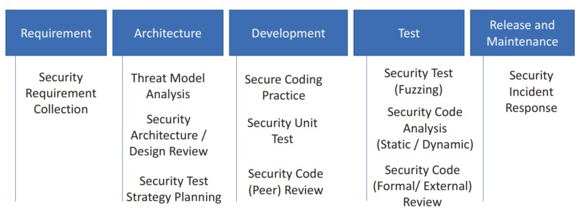
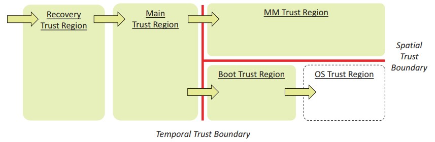
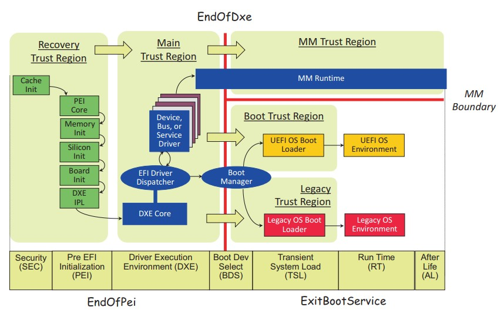

## 第二章

[TOC]

# 主动固件安全开发

固件开发与软件开发相似。几乎所有的软件安全开发生命周期（SDL）实践都可以应用于固件开发。图2-1显示了固件开发中可能涉及的主要活动。

## 需求阶段

第一步是收集安全需求。没有明确的要求，就不知道在什么情况下该保护什么。

### 安全需求

任何产品都有需求。可以将需求视作‘任何渴望或需要的声明’。这包括功能性需求，例如产品应该执行哪些行为。也存在市场需求，例如产品应该何时上市以及花费多少成本。最后，存在安全需求，包括产品必须遵守的安全属性，包括各种威胁的缓解措施。

安全需求也应该包括行业标准要求。如果在美国生产，则需要遵循NIST指南，如NIST SP800-193《平台固件弹性指南》。如果在中国生产，则需要遵循GB(强制)或GB/T（推荐）规范，例如GB/T 36639-可信计算规范：针对服务器的可信的支持平台。如果是X86个人计算机或服务器平台，则可能需要遵循通用可扩展固件接口（UEFI）规范和TCG标准，如PC客户端平台固件概述（PFP）规范或设备标识组合引擎（DICE）架构。如果是ARM产品，则可能需要遵循ARM平台安全架构（PSA）规范或ARMv8M的可信基础系统架构（TBSA）。对于车辆产品，可能需要遵守ISO 26262功能安全要求。

## 威胁模型与架构阶段

威胁模型和安全体系结构来源于安全需求。他们将客户的语言映射为开发人员的语言。

### 威胁模型分析

就威胁而言，威胁模型分析是从假设攻击者的角度识别潜在威胁并对其进行优先处理的过程。威胁模型分析应该在功能架构阶段进行。功能架构师应与安全架构师合作，识别资产、对手和威胁（攻击面），然后确定威胁的优先级，并选择缓解措施。在（进行）这些步骤之前，架构师需要清楚地了解系统是怎么工作的。

现有的书籍和工具可以教授如何执行威胁模型分析。这些现有材料大多从控制流分析（CFA）和数据流分析（DFA）开始。控制流分析（CFA）关注代码如何从一个地方运行到另一个地方。另一方面，数据流分析（DFA）侧重于如何将数据从一个地方移动到另一个地方。

最后，我们需要优先处理这些威胁。应该同时考虑威胁被利用的可能性和对系统的影响。可以选择处理严重的、高优先级的威胁并定义缓解措施。可以选择不处理中等或低优先级的威胁，并留到下一代产品。例如，来自恶意硬件的的威胁之前没有考虑过，现在则需要考虑它，因为硬件攻击越来越频繁。一些新的攻击，例如故障攻击，对于低成本的商业平台被认为是中等优先级，但是对于高品质的平台而言就是高优先级。

为了了解更多细节，以STRIDE威胁模型作为例子。这里讨论的威胁模型是一个通用的指南，是系统固件的基线。对于每个特定的功能，除了通用的威胁模型，还会有额外的基于功能的威胁模型（见表 2-1）。

表 2-1 威胁与所需属性
| **威胁** | **所需属性** |
| :--- | :--- |
| 欺骗 | 身份验证 |
| 篡改 | 完整性 |
| 否认 | 不可否认 |
| 信息暴露 | 机密性 |
| 拒绝服务 | 可适用 |
| 权限提升 | 鉴权 |

在系统固件中，拒绝服务在当前的启动过程中可能是暂时的，也有可能是永久的，在这种情况下，系统不能再次正常启动。后者更为严重，被命名为永久性拒绝服务（PDoS）。

针对固件STRIDE模型，将考虑如表 2-2中所示的对手。

表 2-2 对手与示例
| **对手** | **示例** |
| :--- | :--- |
| 网络攻击者 | 攻击者可能通过网络连接系统以进行窃听，拦截、伪装或修改网络数据包。|
| 无特权软件攻击者 | 攻击者可能在操作系统的应用层中运行ring 3级别的软件。攻击者可能执行基于软件的侧信道攻击（例如使用高速缓存计时）。|
| 系统软件攻击者 | 攻击者可能在操作系统的内核或管理程序中运行ring 0级别的软件。或攻击者可能在固件启动阶段运行第三方固件代码。攻击者可能执行基于软件的侧信道攻击（例如使用高速缓存计时，性能计数，分支信息或电源状态）。|
| 简单的硬件攻击者 | 攻击者可能接触平台硬件（如电源按钮或跳线），并连接/移除简单的恶意设备（例如硬件调试器，PCI桥接外部接口，PCIe[外围组件互联接口]卡接入PCIe卡槽，内存DIMM，NIC电缆，硬驱，键盘，USB设备，蓝牙设备）。攻击者可能劫持简单的设备总线（例如串行外围接口[SPI]总线或I2C总线）。|
| 有技巧的硬件攻击 | 攻击者可能劫持复杂的系统总线，例如内存总线和PCIe总线。攻击者可能执行基于硬件的侧信道攻击，例如功率分析，热分析和电磁分析。攻击者可能执行故障攻击。|

根据美国国家标准与技术研究所（NIST）SP800-193的规定，系统固件设计需要考虑保护、检测和恢复。

为了与BIOS的要求相匹配，BIOS的主要安全目标包括以下内容：
1. 阻止对BIOS代码和关键数据进行任何未经授权的修改（保护）。
2. 使固件组件成为信任链（CoT）的一部分，并提供平台认证（检测）。
3. 在损坏或非法修改后将BIOS恢复到真实状态
修改（恢复）。

三大支柱——保护、检测和恢复——也被认为是主要的缓解措施。对BIOS而言需要考虑的资产是闪存内容、启动流程、S3恢复、管理模式和构建工具。需要对每项资产进行分析。

### 闪存内容
NIST SP800-147和SP800-147B提供了系统固件保护指南，包括系统固件保护和更新的详细信息。NIST SP800-193提供了平台固件弹性指南。它将保护扩展到三个原则：保护、检测和恢复。它还将范围从系统固件（BIOS）扩大到平台上的所有固件。

此处的闪存内容包括固件代码（例如，预先可扩展固件接口初始化（PEI）、驱动程序执行环境（DXE）和引导设备选择（BDS）等）和固件数据（例如，UEFI变量、微代码等）。有关闪存内容的威胁、对手和缓解，请参阅表2-3、2-4和2-5。

表 2-3 针对资产的威胁 —— 闪存内容
| **威胁** | **示例** |
| :--- | :--- |
| 欺骗 | 无 |
| 篡改 | 如果固件没有受到保护或锁定，攻击者可能会直接修改固件。如果固件更新过程未通过验证，则攻击者可能会发送恶意的固件更新映像进行更新。|
| 否认 | 如果固件没有正确实现事件日志记录，恶意程序可能会擦除或截断日志。|
| 信息泄露 | 如果系统软件将机密存储在固件中，则攻击者可能读取固件内容并获取机密。|
| 拒绝服务 | 如果攻击者可能修改固件内容（代码或数据）并导致固件崩溃，则系统可能不再启动。这变成了永久性的拒绝服务。|
| 权限提升 | 如果攻击者可能修改固件内容（代码或数据）并将木马程序存储在固件中，则木马程序可能会隐藏自己并获得更高的权限。|

表 2-4 针对资产的对手 —— 闪存内容
| **对手** | **示例** |
| :--- | :--- |
| 网络攻击者 | 如果网络在X86系统管理模式（SMM）锁定和闪存锁定之前启用，则攻击者可能会发送不正常的网络数据包。|
| 无特权软件攻击者 | 攻击者可能会触发固件更新或写入UEFI变量。|
| 系统软件攻击者 | 攻击者可能访问硅片寄存器来解锁闪存访问寄存器。攻击者可能会创建一个竞争条件来破坏闪存写保护或闪存更新验证。|
| 简单的硬件攻击者 | 攻击者可能在闪存更新或恢复期间按下电源按钮，或者攻击者可能设置跳线将系统启动模式从正常启动修改为恢复甚至制造模式。攻击者可能会在闪存更新或恢复期间附加PCI桥接接口以执行DMA攻击。攻击者可能会劫持SPI总线来读取或写入芯片数据。|
| 有技巧的硬件攻击 | 无 |

表 2-5 针对资产的缓解措施 —— 闪存内容
| **缓解措施** | **示例** |
| :--- | :--- |
| 保护 | 对于代码区域，闪存写保护必须始终应用。在闪存更新过程中，必须对新固件映像进行验证，并检查版本以防止回滚攻击。为了缓解检查时间/使用时间（TOC/TOU）攻击，必须在检查之前将新固件镜像复制到安全环境中。在闪存更新期间必须启用DMA保护。对于数据区域，UEF有效的变量写入必须在隔离的执行环境中进行。有效的变量数据必须经过验证，并且回滚保护必须启用。正如在代码区域保护中一样，为了缓解TOC/TOU攻击，必须在检查之前将新的可变内容复制到安全的环境中，并且DMA保护必须应用于此环境。此外，机密不得保存到固件代码或数据区域。|
| 检测 | 检测发生在下一次启动时。对于代码区域，行业可能有不同的解决方案来确保初始化启动代码未经修改，如Project Cerberus、Intel Boot Guard等。对于数据区域，UEFI变量驱动程序需要检测出在不使用UEFI变量服务的情况下变量区域发生了修改。|
| 恢复 | 如果检测到错误，则检测到故障的实体需要启动恢复过程，并且恢复数据必须处于已知的良好和安全的配置中，并且必须由可信且始终可用的来源交付。|

### 启动流程
系统固件的主要工作是初始化芯片，然后将控制权转移到操作系统。由于固件几乎是运行在系统上的第一个组件，系统固件的另一项职责是维护在统一可扩展固件接口（UEFI）规范中定义的安全启动链和由可信计算组（TCG）定义的可信启动链。

这里的安全启动链意味着第一个实体需要在运行第二个实体前验证其是否良好，如果验证失败则不运行第二个实体。可信启动链意味着第一个实体需要在运行第二个实体前测量它，然后直接运行第二个实体。认证发生在后续。系统固件需要维护两种启动流程。验证和测量不允许绕过。

此外，系统固件可能需要验证最终用户来确定用户是否被授权执行某些动作。例如，用户可能被要求输入硬盘驱动器密码以继续启动。或者用户被要求输入管理员密码以进入设置页面。这些动作也不能被绕过。

表 2-6 针对资产的威胁 —— 启动流程
| **威胁** | **示例** |
| :--- | :--- |
| 欺骗 | 如果固件需要对用户进行验证，攻击者可能伪造身份或绕过身份验证检查。|
| 篡改 | 攻击者可能想要修改安全启动逻辑或可信启动逻辑（代码或配置数据）来绕过验证或测量。|
| 否认 | 无 |
| 信息泄露 | 用户身份和设备密码是秘密信息。攻击者可能想偷走它们。|
| 拒绝服务 | 如果攻击者可能在验证期间修改安全启动的配置数据而导致系统奔溃。|
| 权限提升 | 如果攻击者绕过用户身份验证，他们可能会进入固件设置页面来修改配置。如果攻击者绕过安全启动验证，他们可能会在ring 0级别环境中运行未经授权的第三方代码。|

表 2-7 针对资产的对手 —— 启动流程
| **对手** | **示例** |
| :--- | :--- |
| 网络攻击者 | 攻击者可能会发送不正常的网络数据包来注入代码到系统中。攻击者可能恶意的UEFI镜像来绕过或破坏安全启动逻辑。|
| 无特权软件攻击者 | 攻击者可能写入不正常的UEFI有效变量来破坏安全启动配置。|
| 系统软件攻击者 | 攻击者可能发送命令给隔离的执行环境来修改安全启动配置。攻击者可能使能侧信道来获取内存中的机密。|
| 简单的硬件攻击者 | 攻击者可能附加PCI桥接接口以执行DMA攻击来读取内存中的机密或写入代码区域来绕过验证。|
| 有技巧的硬件攻击 | 攻击者可能劫持内存总线来读取内存中的机密或写入代码区域来绕过验证。|

表 2-8 针对资产的缓解措施 —— 启动流程
| **缓解措施** | **示例** |
| :--- | :--- |
| 保护 | 使用前请检查不受信任的外部输入（如网络数据包、选项ROM、操作系统加载程序和UEFI有效变量）。在验证前不要运行任何不受信任的第三方代码。如果机密生成，在使用后（例如来自HII的临时输入）必须清除。如果机密需要存储，选择包括直接保存机密到硬件（例如TCG OPAL密码），保存散列值加盐值到UEFI有效变量（例如用户密码），或保存机密到隔离环境（例如TCG TPM MOR2）。这种情况下必须启用侧信道预防。DMA保护必须启用。内存总线攻击在范围内，则内存加密必须使用。|
| 检测 | 无 |
| 恢复 | 无 |

启动流程的威胁、对手和缓解措施见表 2-6、2-7和2-8。

### S3恢复
S3恢复是一个特殊的启动流程。它由高级配置和电源接口（ACPI）规范定义。在S3恢复期间，系统从正常启动恢复配置，并跳转到操作系统唤醒向量。

所有应用于正常启动的保护措施也必须应用于S3恢复启动流程。S3恢复的威胁、对手和缓解措施见表2-9、2-10和2-11。

表 2-9 针对资产的威胁 —— S3恢复
| **威胁** | **示例** |
| :--- | :--- |
| 欺骗 | 无 |
| 篡改 | 攻击者可能试图修改S3配置。也作为S3启动脚本被熟知。|
| 否认 | 无 |
| 信息泄露 | 如果S3配置包括机密（例如高级技术附件[ATA] HDD 密码），攻击者可能想要偷走机密。|
| 拒绝服务 | 攻击者可能摧毁S3配置来阻止系统启动。 |
| 权限提升 | 攻击者可能关闭储存在S3配置中的保护措施，例如寄存器锁止。|

表 2-10 针对资产的对手 —— S3恢复
| **对手** | **示例** |
| :--- | :--- |
| 网络攻击者 | 无 |
| 无特权软件攻击者 | 攻击者可能写入不正常的UEFI有效变量来破坏S3配置。|
| 系统软件攻击者 | 攻击者可能发送命令给隔离的执行环境来修改S3配置。如果机密保存在隔离环境，攻击者可能发送命令来获取机密或使用侧信道偷走机密。|
| 简单的硬件攻击者 | 无 |
| 有技巧的硬件攻击 | 无 |

表 2- 11 针对资产的缓解措施 —— S3恢复
| **缓解措施** | **示例** |
| :--- | :--- |
| 保护 | S3配置数据必须保存在安全的地方。存储的安全位置实例包括嵌入式的只读代码区域、只读变量、隔离的执行环境或锁箱（LockBox）。如果S3配置数据是机密，则必须保存在隔离的执行环境或锁箱来防止未授权的读取。|
| 检测 | 无 |
| 恢复 | 无 |

### 管理模式
管理模式是一种特殊的系统执行环境。X86系统拥有系统管理模式（SMM），而ARM有ARM TrustZone。固件代码在管理模式被认为是安全世界，并且拥有很高的权限。管理模式的威胁、对手和缓解措施见表2-12、2-13和2-14。

表 2-12 针对资产的威胁 —— 管理模式
| **威胁** | **示例** |
| :--- | :--- |
| 欺骗 | 无 |
| 篡改 | 攻击者可能更新管理模式内存来注入代码或数据。|
| 否认 | 无 |
| 信息泄露 | 管理模式可能包含机密（例如密码， TPM MOR2熵）或它自身信息（代码和数据结构位置）。这些信息可能暴露在正常世界中。|
| 拒绝服务 | 管理模式只有有限的资源（例如内存）。攻击者可能发送命令给管理模式代码来耗尽资源。 |
| 权限提升 | 攻击者可能在管理模式下获得未经授权的执行权限。例如，如果管理代码调用正常世界代码，攻击者可能用恶意代码替换原来的代码来获得特权执行。攻击者可能针对管理模式构建混淆的代理攻击。例如，操作系统可能发送命令给管理模式代码使之修改管理程序的内存或管理模式内存。|

表 2-13 针对资产的对手 —— 管理模式
| **对手** | **示例** |
| :--- | :--- |
| 网络攻击者 | 无 |
| 无特权软件攻击者 | 无 |
| 系统软件攻击者 | 攻击者可能充分利用管理模式代码中的实现流程读取或修改管理模式内容或更高权限环境的内容，例如管理程序。攻击者可能使用侧信道偷取管理模式内存中的机密。|
| 简单的硬件攻击者 | 无 |
| 有技巧的硬件攻击 | 无 |

表 2-14 针对资产的缓解措施 —— 管理模式
| **缓解措施** | **示例** |
| :--- | :--- |
| 保护 | 管理模式代码在构建后，不晚于第三方代码运行前锁定管理模式。管理模式代码不得调用正常世界的代码。系统必须移除不必要的管理模式的句柄。需要的管理模式的句柄必须在使用前验证不受信任的外部输入，包括通信缓冲通信缓冲内部的指针，用作通信缓冲指针的通用寄存器，硬件基址寄存器。检查后的内容必须拷贝到管理模式内存来预防TOC/TOU。管理模式句柄必须预防未授权访问其自身和更高权限的内容，例如管理程序和操作系统内核内存。管理模式句柄必须预防侧信道攻击弄清任何机密。管理模式句柄不得分配更多的资源来服务请求。如果资源被额外分配，在句柄返回正常世界前就必须被释放。 |
| 检测 | 无 |
| 恢复 | 无 |

### 构建工具
1983年，Ken Thompson和Dennis Ritchie一起获得了图灵将。Ken Thompson发表了题为“关于信任的信任的反思”，并展示了如何注入特洛伊木马到编译器中。之后，编译器产生了有缺陷的二进制。攻击工具并非不可能。这不是传统的针对最终系统的攻击，但是代表了针对构建环境中的工具链的攻击。

缓解措施只有信任来自可信来源的工具链和源代码，之后保护构建环境中的工具链。

| **注释** | 并不是所有的固件共享上文展示的相同的威胁模型。有些主机固件可能不支持S3恢复。像这样的，S3恢复资产不存在。有些设备固件可能不支持管理模式。像这样的，管理模式资产不存在。对那些非主机固件而言，运行时服务可能成为另一种资产。|
| :--- | :--- |

### 非主机运行时服务
运行时服务是非主机固件提供的服务。它与正常的主机操作系统环境共存，例如基板管理控制器（BMC）用于服务器平台，嵌入式控制器（EC）用于客户端平台。运行时服务能提供向主机操作系统提供本地服务或向远程系统提供带外（OOB）服务。

BMC作为实例，其威胁、对手和缓解措施见表 2-15、2-16和2-17。

表 2-15 针对资产的威胁 —— 非主机运行时服务
| **威胁** | **示例** |
| :--- | :--- |
| 欺骗 | 攻击者可能破坏用户身份认证流程来访问BMC内部数据。 |
| 篡改 | 攻击者可能更新BMC内存存储来注入代码或数据。|
| 否认 | 攻击者可能截断保存在BMC中事件日志。 |
| 信息泄露 | BMC可能包括敏感信息（例如用户管理数据）。这些信息可能暴露给正常世界。|
| 拒绝服务 | BMC带外网络服务可能有网络拒绝服务（DOS）风险。|
| 权限提升 | 攻击者可能获取内存中或SPI闪存上的BMC内部权限数据。|

表 2-16 针对资产的对手 —— 非主机运行时服务
| **对手** | **示例** |
| :--- | :--- |
| 网络攻击者 | 攻击者可能通过RedFish和/或智能平台管理接口（IPMI）发送不正常的包给BMC运行时带外（OOB）服务。 |
| 无特权软件攻击者 | 无 |
| 系统软件攻击者 | 攻击者可能通过RedFish和/或智能平台管理接口（IPMI）或通过处于主机和BMC之间专用的本地总线发送不正常的包给BMC运行时带外（OOB）服务。|
| 简单的硬件攻击者 | 无 |
| 有技巧的硬件攻击 | 无 |

表 2-17 针对资产的缓解措施 —— 非主机运行时服务
| **缓解措施** | **示例** |
| :--- | :--- |
| 保护 |所有来自带外或带内的网络包在使用前应该被验证。BMC中的网络栈应该抵御网络拒绝服务（DOS）。用户身份验证应该在访问BMC资源前完成。用户身份验证不得以任何方式绕过。管理员和普通用户的权限应该分开。管理工作只能使用管理员账户完成。敏感信息不得以明文形式保存在BMC闪存中。来自主机本地总线的命令也应该被验证。 |
| 检测 | 无 |
| 恢复 | 无 |

## 安全架构与设计

一旦确定了威胁和缓解措施，就需要设计固件。“计算机系统中的信息保护”提供了通用的安全设计准则，例如经济适用原则、失败——默认安全、完全仲裁、开放设计、权限分离、最小权限、最小公共化原则和心理可承受，这些准则至今仍能使用。

从信任区域开始。不同的信任区域被信任边界隔离。信任边界可以是时间的或空间的。以图2-2展示的系统固件启动流程作为例子。垂直线显示了时间的信任边界，水平线显示了空间的信任边界。

    1. 恢复信任区域: 平台重置后，进入恢复信任区域。这被当作恢复的信任根（RTRec）。恢复信任区域执行基本的初始化并加载下一个组件 ———— 主信任区域。根据启动模式，主信任区域来自主要的闪存区域或可恢复闪存区域。
    2. 主信任区域：这是最大的信任区域。所有的系统初始化应该在此信任区域内完成。此区域仅执行原始设备制造商（OEM）的代码。没有第三方的代码可以在此区域内执行。通常，这个区域被当作更新的信任根。此区域推出之后，闪存应该被锁住。闪存更新应该在此区域内完成。此区域加载启动信任区域作为下一个阶段。这里有条红线，因为这是在任何第三方代码开始执行前最后一个锁定所需接口的机会。
    3. 启动信任区域：系统初始化结束之后，它开始启动操作系统。第三方代码可能运行在此，例如操作系统加载程序或PCI选项ROM。作为最后一步，操作系统的加载程序把控制转交给操作系统，然后进入操作系统信任区域。
    4. 管理模式（MM）信任区域：前面三个信任区域都是短暂的。管理模式信任区域在运行时可用。它可能由主信任区域加载。只有管理模式的代码才能运行在管理模式信任区域，例如X86系统管理模式或ARM TrustZone。管理模式信任区域中的数据可能被恢复信任区域或主信任区域所信任，因为管理模式信任区域被当作安全世界。安全世界能被非安全世界所信任。

为了将信任区域与UEFI/PI BIOS匹配，可以见图2-3显示的流程。安全（SEC）和预先可扩展固件接口（Pre-EFI）初始化(PEI)能被当作恢复信任区域。它能检测启动模式并决定哪里启动。驱动程序执行环境（DXE）是主信任区域。它加载驱动程序并初始化被当作管理模式信任区域的系统管理模式（SMM）。之后系统启动到启动设备选择（BDS）阶段。启动设备选择（BDS）可以选择是启动到UEFI操作系统或传统的操作系统。由于UEFI安全启动在启动信任区域启用，我们将启动信任区域与传统的信任区域分开。因此，信任链在操作系统启动期间得以维护。在传统信任区域中，不执行任何验证，并且信任链已被破坏。在图2-3中，我们在主信任区域之后画了一条红色的垂直线。这这是一个体系结构点，表示平台退出制造商的授权状态并且开始运行第三方代码。在UEFI平台初始化（PI）规范中，此事件命名为驱动程序执行环境结束(EndofDxe)。管理模式信任区域和引导信任区域之间的水平线显示了高权限管理模式执行环境与正常执行环境之间的隔离。

