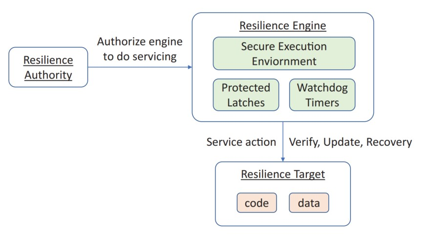

## 第三章

# 固件弹性：保护

固件弹性包括三个元素：保护、检测和恢复。保护是指保护固件组件免受攻击。保护是固件弹性的一个主动方面，而检测和恢复是被动机制。对于弹性而言，主要威胁来自软件攻击者和硬件攻击者。

## 弹性构建块

弹性构建块包括三个部分：

    1） 弹性目标：它是可改变的引擎，包括代码和数据。
    2） 弹性引擎：为弹性目标提供服务的不可改变的引擎，例如保护、验证、更新或恢复。
    3） 弹性授权机构：授权弹性引擎在弹性目标上执行服务的实体。

在弹性引擎内部存在三个主要块：

    1） 安全执行环境（SEE）：这是一个安全的执行立足点来确保一个妥协的弹性目标不会影响恢复。
    2） 保护锁存，例如写入锁和读取锁：这是为了确保在弹性引擎中的永久的储存不能被妥协的弹性目标篡改。
    3） 看门狗计时器：这是为了确保妥协的弹性目标不能影响弹性引擎执行恢复动作。

图3-1显示了弹性构建块。

图 3-1 弹性构建块

为了支持关键弹性，我们需要定义一组信任根（RoTs）。这些信任根包括更新信任根（RTU）、检测信任根（RTD）、恢复信任根（RTRec）。一些功能也能在锚定在信任根中的信任链（CoT）中实现。我们也需要定义相关的更新信任链（CTU）、检测信任链（CTD）和恢复信任链（CTRec）。那些弹性信任根（RTRes）在弹性引擎中，并且提供服务，例如保护与更新、检测和恢复。我们将在第3、4和5章中逐一讨论。

一个平台可能有不同的固件组件。我们做了如下分类：

    • 不可改变的ROM（包括代码和数据）
    • 可更新的固件（包括代码和数据）
    • 配置数据

基于这些分类，我们可能使用不同的保护机制。
